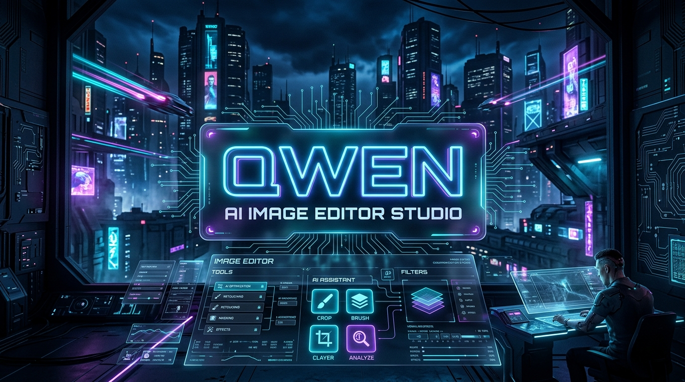
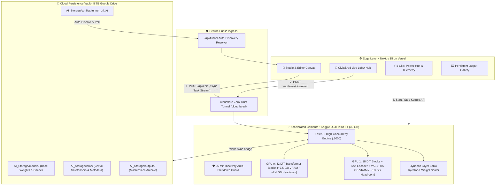
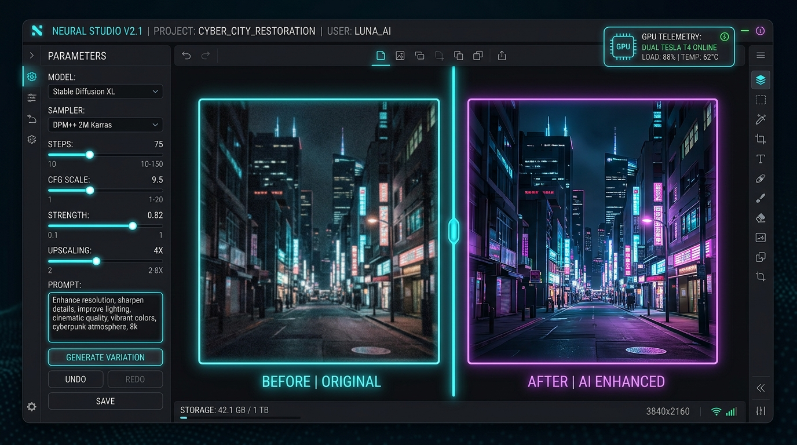
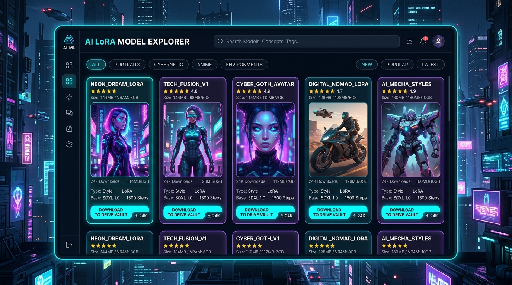

<div align="center">

<!-- ─── BRANDING BANNER ─────────────────────────────────────────── -->


# ⚡ QWEN IMAGE EDITOR STUDIO &bull; CIVITAI EDITION ⚡
### *Next-Gen Multi-GPU Diffusion Workstation &bull; Civitai.red LoRA Hub &bull; 5 TB Google Drive Vault*

<p align="center">
  <a href="https://qwen-image-editor-studio.vercel.app"></a>
  <a href="#"></a>
  <a href="#"></a>
  <a href="https://civitai.red"></a>
  <a href="./LICENSE"></a>
</p>

---

<p align="center">
  <b>A state-of-the-art AI image editing platform running Qwen-Image-Edit-2511-4bit across partitioned Dual Tesla T4 GPUs with zero-touch tunnel discovery, dynamic multi-LoRA fusion, and persistent cloud synchronization.</b>
</p>

</div>

<br />

---

## 🌌 System Architecture & Flow



<br />

---

## 📸 Application Interface Showcase

<div align="center">

### 🎨 Studio & Editing Workspace
*Dual preview canvas with before/after comparison, Qwen True-CFG tuning, guidance scales, seed lock, and live async inference progress bar.*



<br /><br />

### 🧩 Civitai.red LoRA Model Explorer
*Browse thousands of community LoRAs with large 3:4 aspect thumbnails, live download statistics, ratings, trigger word copy pills, and direct 1-click download to your 5 TB Google Drive Vault.*



</div>

<br />

---

## 💎 Core Capabilities & Breakthroughs

<table>
  <thead>
    <tr style="background: rgba(10, 15, 30, 0.8);">
      <th style="color: #00F0FF; text-align: left;">Feature</th>
      <th style="color: #7928CA; text-align: left;">Architecture Implementation</th>
      <th style="color: #00DF8F; text-align: left;">Production Benefit</th>
    </tr>
  </thead>
  <tbody>
    <tr>
      <td><b>🎯 42/18 DiT Golden Ratio</b></td>
      <td>Dual Tesla T4 pipeline partitioning (42 DiT blocks on GPU 0; 18 blocks + Qwen2.5-VL text encoder + VAE on GPU 1)</td>
      <td><b>Zero CUDA OOM</b>: Leaves 6.3 GB – 7.4 GB free headroom on both cards, enabling 448px full attention without memory crashes.</td>
    </tr>
    <tr>
      <td><b>🧩 Civitai.red LoRA Hub</b></td>
      <td>Native Civitai REST API integration with real-time model searching, base model filtering, and preview galleries</td>
      <td>Explore and filter thousands of styles, characters, and enhancers directly inside the app with zero external tabs.</td>
    </tr>
    <tr>
      <td><b>💾 5 TB Google Drive Vault</b></td>
      <td>High-speed bi-directional <code>rclone</code> synchronization for models, LoRAs, generated outputs, and configs</td>
      <td>Full persistence across Kaggle resets. All downloaded LoRAs and generated outputs are permanently stored in Google Drive.</td>
    </tr>
    <tr>
      <td><b>🔄 Dynamic GPU LoRA Fusing</b></td>
      <td>Hot-swappable <code>pipe.fuse_lora(lora_scale)</code> endpoint with custom weight multipliers (0.0 to 2.0)</td>
      <td>Inject new artistic styles in real time with animated visual loading feedback without restarting the Python backend.</td>
    </tr>
    <tr>
      <td><b>⚡ Zero-Touch Auto-Discovery</b></td>
      <td>Ingress supervisor registers Cloudflare Tunnel into Google Drive Vault and Vercel memory registry</td>
      <td><b>No manual URL copying or pasting</b>. The frontend auto-detects and locks onto the live GPU backend automatically.</td>
    </tr>
    <tr>
      <td><b>🛡️ 25-Min Idle Auto-Shutdown</b></td>
      <td>Continuous background daemon monitoring inactivity and terminal execution guard</td>
      <td>Guarantees zero wasted Kaggle GPU quota if you fall asleep or leave the session unattended.</td>
    </tr>
    <tr>
      <td><b>📊 Vercel Web Analytics</b></td>
      <td>Integrated <code>@vercel/analytics</code> privacy-first telemetry</td>
      <td>Track real-time visitor traffic, device distributions, and usage metrics on the production web interface.</td>
    </tr>
  </tbody>
</table>

<br />

---

## ⚡ Multi-GPU VRAM Partitioning Blueprint

Below is the verified hardware telemetry across the Kaggle Dual Tesla T4 configuration:

```
========================================================================================
⚡ TESLA T4 DUAL-GPU HARDWARE TELEMETRY & VRAM ALLOCATION
========================================================================================
[GPU 0] Tesla T4 (15 GB VRAM)
├── 42 DiT Transformer Blocks (bfloat16)  : ~7,520 MB Allocated
└── Activation & Attention Headroom        : ~7,391 MB FREE (Safe for 448px DiT)

[GPU 1] Tesla T4 (15 GB VRAM)
├── 18 DiT Transformer Blocks (bfloat16)  : ~3,180 MB Allocated
├── Text Encoder (Qwen2.5-VL 4-bit)       : ~4,620 MB Allocated
├── Autoencoder KL (VAE)                  : ~826 MB Allocated
└── Activation & Attention Headroom        : ~6,285 MB FREE (Safe for inference)
========================================================================================
✅ Total VRAM: 30 GB | Allocated: ~16.1 GB | Combined Free Headroom: ~13.7 GB (Zero OOM)
========================================================================================
```

<br />

---

## 🚀 Quickstart & Deployment Guide

### 1. Prerequisites
* **Node.js** v18+ & **npm**
* **Python** 3.10+ (PyTorch 2.4+, Diffusers, Transformers, Accelerate)
* **Kaggle Account** with GPU access (Dual Tesla T4)
* **Google Drive API Credentials** (OAuth Client ID & Secret for rclone)
* **Civitai Account** (API Key for authenticated model downloads)

---

### 2. Frontend Deployment (Vercel)

```bash
# Clone the repository
git clone https://github.com/motherskitchenblr2/Qwen--Image-Editor-Civitai-Version.git
cd Qwen--Image-Editor-Civitai-Version/frontend

# Install dependencies
npm install

# Configure Environment Variables (.env.local or Vercel Dashboard)
KAGGLE_API_TOKEN="your_kaggle_api_bearer_token"
CIVITAI_API_KEY="your_civitai_api_key"

# Run development server
npm run dev

# Or build for production
npm run build
```

---

### 3. Backend Deployment (Kaggle Dual Tesla T4)

The backend runs on Kaggle with dual GPU acceleration and automatically hosts an authenticated FastAPI microservice tunneled through Cloudflare.

```bash
# Push and trigger the Kaggle GPU kernel directly from CLI
kaggle kernels push -p ./backend

# Or start directly using the Termux shortcut:
start-gpu
```

#### What happens during backend boot:
1. Allocates Dual Tesla T4 GPUs (`accelerator: "nvidia-tesla-t4", count: 2`).
2. Mounts Google Drive 5 TB Vault via `rclone` config.
3. Downloads & caches Qwen Transformer weights and VAE.
4. Partitions the pipeline using the **42/18 DiT Golden Ratio**.
5. Initializes Cloudflare Zero-Trust Tunnel.
6. Publishes the live tunnel endpoint to `AI_Storage/configs/tunnel_url.txt` and registers with Vercel.
7. Web studio detects the tunnel within seconds and connects automatically.

---

### 4. Quota Guard & Session Terminator

To deallocate your Kaggle GPU instance and preserve weekly quota:

* **From the Web App**: Click **`[🛑 Turn Off GPU]`** in the top navigation bar.
* **From the Terminal**:
  ```bash
  stop-gpu
  ```

<br />

---

## ⚙️ Environment Configuration Reference

To protect secrets, configure environment variables in your secure vault (e.g. Dopbase or Vercel Project Settings):

| Variable | Description | Where It Is Used |
| :--- | :--- | :--- |
| `KAGGLE_API_TOKEN` | Kaggle API authentication bearer token | Vercel `/api/backend/start` to boot Dual T4s |
| `CIVITAI_API_KEY` | Authenticated Civitai API key for model downloads | Kaggle backend & Next.js Civitai proxy |
| `GDRIVE_CLIENT_ID` | Google Drive OAuth Client ID | Kaggle `rclone` bridge to 5 TB Vault |
| `GDRIVE_CLIENT_SECRET` | Google Drive OAuth Client Secret | Kaggle `rclone` bridge to 5 TB Vault |
| `IDLE_TIMEOUT_SECONDS` | Inactivity timer before auto-shutdown (Default: `1500s` / 25 min) | Kaggle watchdog daemon |

> [!IMPORTANT]
> **Zero Plaintext Secrets Standard**: Never commit plaintext API keys or access tokens into source control. Always inject variables at runtime or scope them securely.

<br />

---

## 🛠️ Technology Stack

<div align="center">

| Domain | Technologies |
| :--- | :--- |
| **Frontend Framework** | Next.js 15 (App Router), React 19, TypeScript, Tailwind CSS, Lucide Icons |
| **Analytics & Telemetry** | Vercel Web Analytics (`@vercel/analytics`) |
| **AI / Diffusion Engine** | Qwen-Image-Edit-2511-4bit, Hugging Face Diffusers, Accelerate, PyTorch 2.4 |
| **Microservice & API** | FastAPI, Uvicorn, Pydantic, Python 3.12 |
| **Networking & Ingress** | Cloudflare Zero-Trust Tunnel (`cloudflared`), Serverless HTTP API Proxies |
| **Storage & Persistence** | 5 TB Google Drive Cloud Vault, `rclone` bi-directional mirror |
| **Compute Accelerator** | Dual NVIDIA Tesla T4 GPUs (30 GB combined GDDR6 VRAM) on Kaggle |

</div>

<br />

---

## 📜 License

This project is licensed under the **MIT License** &bull; see the [LICENSE](./LICENSE) file for complete details.

<div align="center">
  <sub>Engineered with precision for Next-Gen Creative AI &bull; Built by Developer Chief</sub>
</div>
